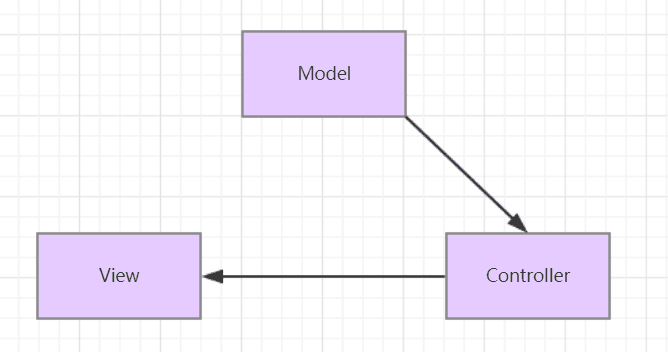
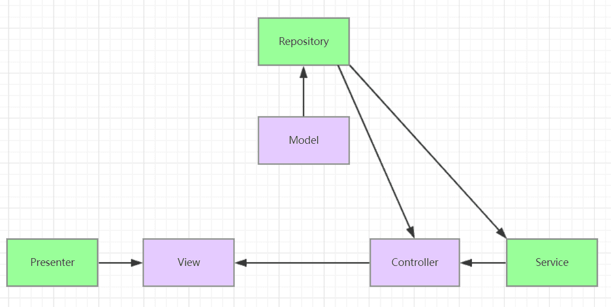

# Laravel-数据处理与业务逻辑划分

> 曾受教于MVC,那么这次跨过初学者的身份来剖析laravel框架的在中、大型项目中的层次划分与运用

* **初学者身份时我是这样理解MVC的：**



Model就是对应数据库，处理数据返回所需要的数据。  
 Controller负责与HTTP沟通，调用model中的数据返回给view显示。  
 View就是用户看到的HTML。

而确实这样做也可以将一个项目整出来，但是一旦需求中的数据格式发生变化或者需要改动的时候，就要重新写model中对应的方法，跟着controller和View也会有相应的改动。核心功能流程改动，维护成本和时间花费量都比较多。

* **根据S.O.L.I.D原则对MVC进行重新定义后：**



> 根据数据库逻辑CURD来讲，CUD相对来说都是比较稳定的，大部分的数据库逻辑都在描述R的操作。再从面相对象的角度思考，CURD都是属于动态的，可以归为一个块，那么就将它以及之后的数据处理从model中分离出来放在repository中，以辅助model。\(相当于是将其作为一个扩展\)而model实际需要关心的是：一个model对象中，它的属性是否包含数据库中一张表的所有字段以及相对应的数据类型，并且一致&&不能多&&不能少。这样model就成了一个Eloquent class，不再包含数据库逻辑，只需要保留基本属性和基本Method。也方便其他类调用时的扩展。

> 而Presenter是用来辅助View处理页面显示逻辑的，方便以后维护。简单点理解就是消除将页面中的@if...@else进行转移。看下面两段代码:


```text
  @foreach($users as $user)
    <h4>    
    @if($user->gender == 'm')
      {{"Mr."}}@else{{"Mrs."}}        
    @endif
      $user->name
    </h4>
  @endforeach
```

```text
UserPresenter.php
namespace App\Presenters;
class UserPresenter{
    /**
     * @param string $gender
     * @param string $name
     * @return string
     */
    public function getFullName($gender, $full_name)
    {
        if ($gender == 'M')
            $fullName = 'Mr. ' . $full_name;
        else
            $fullName = 'Mrs. ' . $full_name;

        return $fullName;
    }
}
view中：
@foreach($users as $user)
    @inject("UserPresenter",'App\Presenters\UserPresenter'); 
    <h4>{{$UserPresenter->getFullName($user->gender,$user->name)}}</h4>
@endforeach
```

显而易见，presenter将页面的数据显示逻辑分离出来了，在对显示逻辑做重构时，使得View层不需要变化，不再需要关心多种的逻辑写码，并且这样很大程度上提高了代码的可读性。并且可以使用面向对象来处理。

> 再来看service层是怎么辅助controller的，很多时候，都controller需要调用外部接口，比如发送email、查询归属地、银行发报行号等等，这些都是属于外部行为；还有就是一些会随着项目的扩大而增加的数据\(需要通过不同的算法去计算的或者是不同的方法去实现\)，这一块也可以抽离出来放在service层，这样controller就只进行了了业务逻辑，而没有进行其他逻辑，遵循了单一职责原则。

* 很多时候service层和repository层可能会归为一个层，都是让controller去获取需要的数据的，从数据的调用角度来讲，也是合理的。当然，具体的划分看业务需求，也可以多划分出一层去存放算法规则，和常量，用魔术方法去实现调用。


