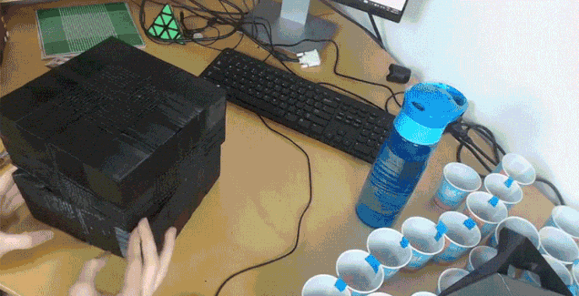
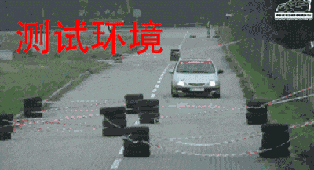

# 21个令程序员泪流满面的瞬间

1.公司实习生找 Bug

2.在调试时，将断点设置在错误的位置

3.当我有一个很棒的调试想法时

4.偶然间看到自己多年前写的代码

5.当我第一次启动我的单元测试时

6.数据库的Delete语句忘了使用限定词where...

7.明明是个小bug但就是死活修不好......

8.当我尝试调整生产数据库中的一些东西时

9.好像真的没人发现我产品里的bug......

10.下班前我还有一项任务没有完成

11.产品还没测试直接投入生产时

12.调试过多线程的都会懂！

13.当我以为已捕获了所有可能的异常...的时候

14.当我试图清理几行所谓的旧代码的时候

15.当有人让我帮他调试代码时

16.当程序员第一次向老板演示项目时

17.结对编程，需要再了解一下吗？

18.当你看到你几个月没碰过的代码

19.接到产品经理电话的我睡意全无！

20.测试的时候一切ok，真正上线的时候……

21.作为一个程序员，拷问灵魂的时刻到了！

  

