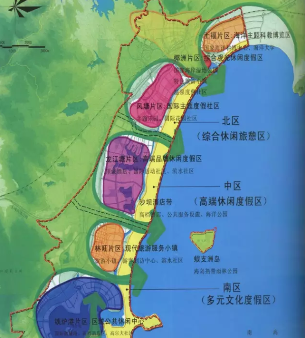

# 三亚旅行规划

航班：    三亚凤凰国际景点：   

 大东海：鹿回头、凤凰岛    

三亚湾：南山寺（海上观音）、千古情、 椰梦长廊、西岛    

亚龙湾：热带天堂森林公园、玫瑰谷、鸟巢度假村    海棠湾：蜈支洲岛、呀诺达、槟榔谷、国际免税城

住宿：    三亚湾地中海湾原野精品酒店、    亚龙湾金棕榈度假酒店、    海棠湾9号温泉度假酒店、

饮食：    三亚湾：地中海湾过马路对面左侧的壹家人\(团购\)、第一市场、林姐香味海鲜、龙泉人椰子鸡、甜蜜蜜清补凉、师部农场美食街    

亚龙湾：1号小镇奥特莱斯、亚泰商业中心、百花谷（琼味馆、海角九号）   

 海棠湾：鸿港码头

